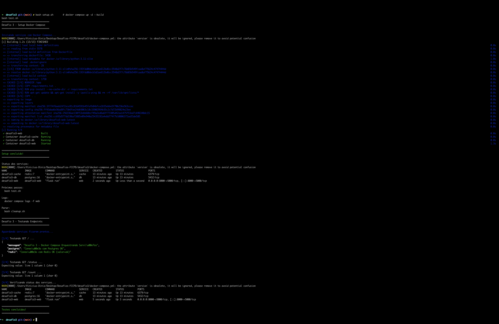
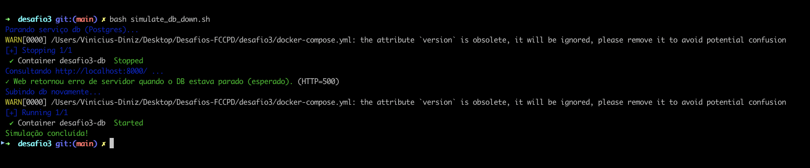

# Challenge 3 — Docker Compose Orchestrating Services

## Objective

Use **Docker Compose** to orchestrate an application composed of **3 services**:

- `web`: Flask application that exposes an HTTP API.
- `db`: PostgreSQL database.
- `cache`: Redis cache service.

The web application communicates with the database and cache via an internal network created by Compose.


## Architecture

### Services

- **web (desafio3-web)**
  - Image built from `web/Dockerfile`.
  - Exposed port: `5000` (mapped to `8000` on the host).
  - Technologies: Python, Flask, psycopg2, Redis.
  - Reads environment variables (`DB_HOST`, `DB_USER`, etc.) defined in `docker-compose.yml`.
  - Main functions:
    - Creates `visitas` table in Postgres (if it doesn't exist).
    - Inserts a new record on each request.
    - Counts how many records exist.
    - Increments a visit counter in Redis (`visitas_home`).

- **db (desafio3-db)**
  - Image: `postgres:16`.
  - Environment variables:
    - `POSTGRES_USER=usuario`
    - `POSTGRES_PASSWORD=senha123`
    - `POSTGRES_DB=desafio3db`
  - Uses the named volume `db-data` to persist data.
  - Accessed by hostname `db` within the `desafio3-net` network.

- **cache (desafio3-cache)**
  - Image: `redis:7`.
  - Accessed by hostname `cache`.
  - Stores the visit counter in memory.

### Network and Volumes

- Internal network: `desafio3-net`
  - Created automatically by Compose.
  - All three services are connected to it.
  - Allows `web` to access `db` and `cache` by hostnames.

- Volume: `db-data`
  - Stores PostgreSQL data.
  - Declared in `volumes:` in `docker-compose.yml`.


## Project Structure

```
desafio3/
├── docker-compose.yml
├── setup.sh          # Starts the stack with Docker Compose
├── test.sh           # Tests application endpoints
├── reset-db.sh       # Removes volume and recreates clean database
├── cleanup.sh        # Stops and removes services
└── web/
    ├── Dockerfile
    ├── requirements.txt
    └── app.py
```


## Quick Execution (Automated)

  # 1) Quick start (one-line)
  cd desafio3 && bash setup.sh && bash test.sh

  # 2) Automated steps (split)
  bash setup.sh
  bash test.sh

    # 3) Simulate DB failure (check fallback/status)
    bash simulate_db_down.sh
    # 4) Reset database (deletes db-data volume)
    bash reset-db.sh

    # 4) Clean up entire stack
    bash cleanup.sh

  ## Verify (expected result)

  1) Check web endpoint:
  ```bash
  curl http://localhost:8000/
  ```
  Expect JSON including keys: `db_status`, `redis_status`, `total_registros_db`, `visitas_redis`.

  2) Confirm the ping tests:
  ```bash
  docker compose exec web ping -c 2 db
  docker compose exec web ping -c 2 cache
  ```
  Expect successful ping responses.

## Step-by-Step Execution (Manual)

    1) Start services
      docker compose up -d --build
    1.1) (Optional) verification
      docker compose ps

    2) Access application
      curl http://localhost:8000 | Select-Object -Expand Content

    3) Communication test
      docker compose exec web ping -c 2 db
      docker compose exec web ping -c 2 cache

    #Prints




## Evaluation Checklist
- ✅ Working code: `docker-compose.yml` and `web/Dockerfile` ready
- ✅ README with instructions and scripts: `setup.sh`, `test.sh`, `reset-db.sh`, `cleanup.sh`
- ✅ Automated basic tests integrate services (`bash test.sh`)
- ✅ Troubleshooting added for common issues (ports, volumes)

## Troubleshooting

### Error: "bind: address already in use"
If port 8000 is already in use, use another port when starting Compose:
```bash
docker compose down
# Set the environment variable or edit the compose to use 8001:5000
docker compose up -d --build
```

### Error: "volume is in use" when removing volume
Make sure services are stopped before removing the volume:
```bash
docker compose down
docker volume rm db-data
```

### Web cannot connect to Postgres
1. Check if environment variables in `docker-compose.yml` are correct (DB_HOST=db)
2. Access the web container and run pings:
```bash
docker compose exec web ping -c 3 db
docker compose exec web bash -c "psql -h db -U usuario -d desafio3db -c '\dt'" || true
```

## Key Concepts

- Docker Compose creates networks by default, so services communicate by hostname.
- Volumes persist Postgres data as long as the `db-data` volume exists.

- Use `docker compose down -v` to remove volumes with caution.
