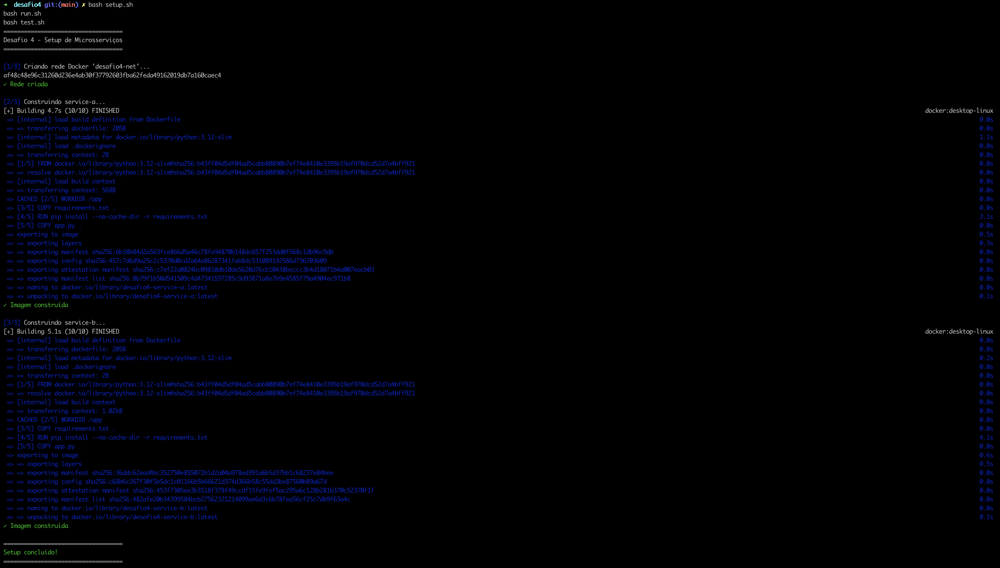
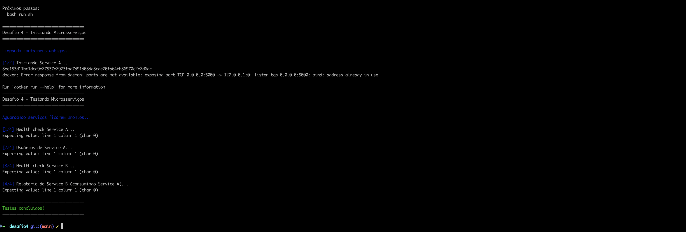
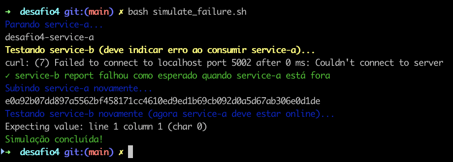

# Desafio 4 — Microsserviços Independentes

## Objetivo

Criar **dois microsserviços independentes** que se comunicam via HTTP:

- **Microsserviço A (service-a)**: expõe uma lista de usuários em JSON.
- **Microsserviço B (service-b)**: consome o serviço A, combina as informações e devolve um “relatório” com frases do tipo  
  `“Usuário X ativo desde Y”`.

Cada microsserviço roda em um **container Docker separado**, com seu próprio Dockerfile, e a comunicação acontece via HTTP usando uma **rede Docker customizada (`desafio4-net`)**.


## Arquitetura da Solução

### Visão Geral

- **service-a**
  - Framework: Flask (Python).
  - Endpoint principal: `GET /users`
  - Retorna uma lista fixa de usuários em JSON, por exemplo:
    ```json
    [
      {"id": 1, "name": "Gabriel", "active_since": "2023-01-10"},
      {"id": 2, "name": "Maria",   "active_since": "2022-09-02"},
      {"id": 3, "name": "João",    "active_since": "2021-05-15"}
    ]
    ```
  - Endpoint de saúde: `GET /health` → `{"status": "ok"}`

- **service-b**
  - Framework: Flask (Python) + `requests`.
  - Endpoint principal: `GET /report`
    - Chama o microsserviço A via HTTP.
    - Lê o JSON de `/users`.
    - Monta frases como:
      ```text
      "Usuário Gabriel ativo desde 2023-01-10"
      ```
    - Retorna um JSON como:
      ```json
      {
        "source": "http://service-a:5000/users",
        "total_users": 3,
        "messages": [
          "Usuário Gabriel ativo desde 2023-01-10",
          "Usuário Maria ativo desde 2022-09-02",
          "Usuário João ativo desde 2021-05-15"
        ]
      }
      ```
  - Endpoint de saúde: `GET /health` → `{"status": "ok"}`
  - A URL do serviço A é configurada via variável de ambiente `USERS_API_URL`.

### Rede Docker

- Rede: **`desafio4-net`**
  - Criada manualmente com `docker network create`.
  - Conecta os containers `service-a` e `service-b`.
  - Dentro da rede, o `service-b` acessa o `service-a` pelo hostname `service-a` na porta `5000`.

### Esquema (conceitual)


               +---------------------------+
               |        Host (PC)          |
               |                           |
               |  http://localhost:5003   --> service-a (/users)
               |  http://localhost:5002   --> service-b (/report)
               +---------------------------+

                 (rede Docker: desafio4-net)
                          |
          +---------------+---------------+
          |                               |
     +-------------+                 +-------------+
     |  service-a  |  <--- HTTP ---  |  service-b  |
     | Flask /users|                 | Flask/report|
     +-------------+                 +-------------+

## Estrutura de Pastas
```
desafio4/
├── service-a/
│   ├── app.py
│   ├── requirements.txt
│   └── Dockerfile
├── service-b/
│   ├── app.py
│   ├── requirements.txt
│   └── Dockerfile
```

## Execução Rápida (Automatizada)

  # 1) Quick start (one-line)
  cd desafio4 && bash setup.sh && bash run.sh && bash test.sh

  # 2) Setup (separado)
  bash setup.sh

  # 2) Iniciar microsserviços
  bash run.sh

  # 3) Testar automaticamente
  bash test.sh

  # 4) Simular falha do service-a
  bash simulate_failure.sh

  # 5) Limpar tudo
  bash cleanup.sh

## Verify (expected result)

1) Check service-a users list:
```bash
curl http://localhost:5003/users
```
Expect JSON list of users (id, name, active_since).

2) Check service-b report:
```bash
curl http://localhost:5002/report
```
Expect JSON with `source`, `total_users` and an array of `messages` with sentences like "Usuário Gabriel ativo desde 2023-01-10".

## Como executar (manual)
    Todos os comandos abaixo são executados a partir da pasta desafio4

    1) Criar a rede Docker
      docker network create desafio4-net

    2) Build de imagens
    2.1) service-a
        docker build -t desafio4-service-a ./service-a
    2.2) service-b
        docker build -t desafio4-service-b ./service-b

    3) Subir o Microsserviço A
        docker run -d --name service-a --network desafio4-net -p 5003:5000 desafio4-service-a

    3.2) Subir o Microsserviço B
        docker run -d --name service-b --network desafio4-net -p 5002:5000 -e USERS_API_URL=http://service-a:5000/users desafio4-service-b

    4) Verifica se os containers estao de pe
        docker ps --format "table {{.Names}}\t{{.Status}}\t{{.Ports}}"

    5) Testar microsserviço A
        curl http://localhost:5003/users
    5.1) Testar o B
      curl http://localhost:5002/report

  ## Troubleshooting

  ### Service B falha ao consumir A
  Se o `service-b` não conseguir alcançar `service-a`, verifique:
  - Se ambos os containers estão na mesma rede `desafio4-net`.
  - Se a variável `USERS_API_URL` está corretamente apontando para `http://service-a:5000/users`.
  Verifique logs:
  ```bash
  docker logs -f desafio4-service-b
  ```

  ### Porta ocupada
  Se `5003` ou `5002` estiver ocupado no host, use outra porta de mapeamento no `docker run`.

  ### Verificando a disponibilidade
  Para testar se `service-a` está respondendo:
  ```bash
  curl http://localhost:5003/users
  ```

  Para testar `service-b`:
  ```bash
  curl http://localhost:5002/report
  ``` 

# Prints






