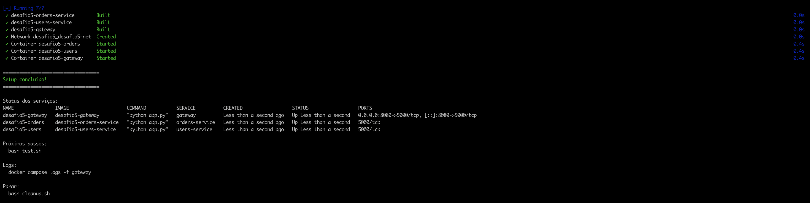
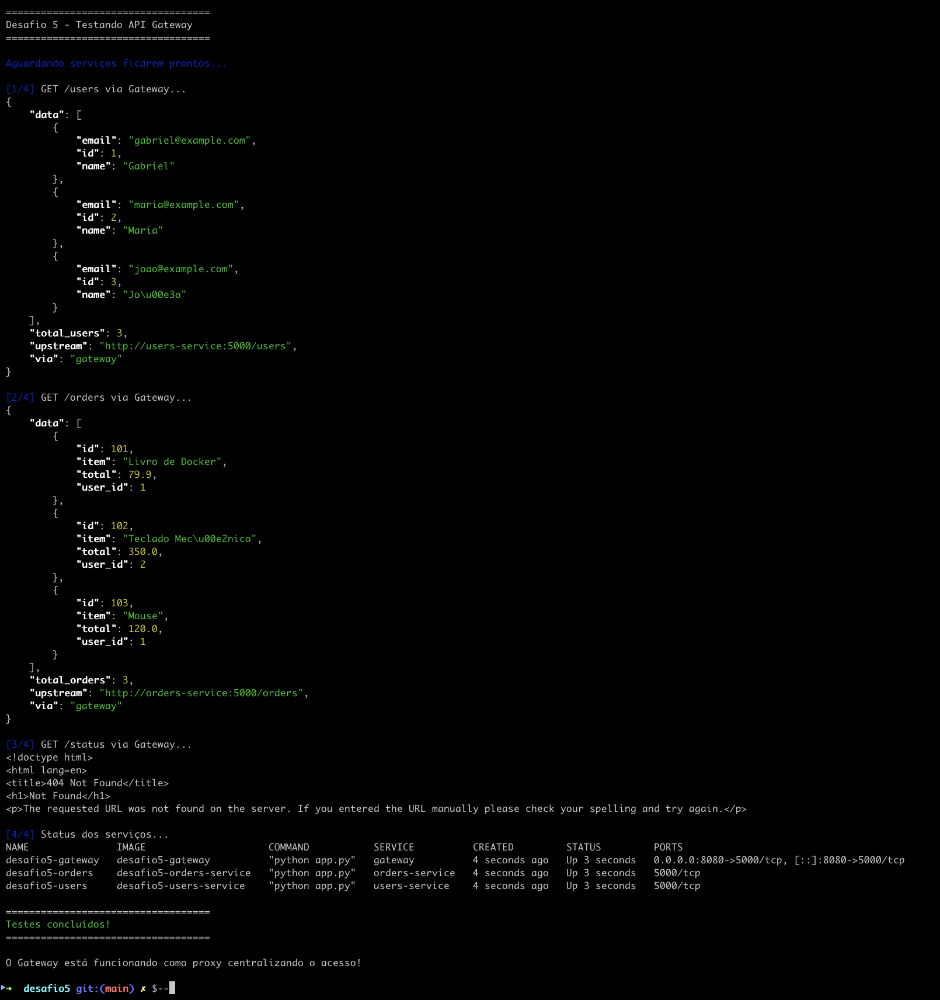
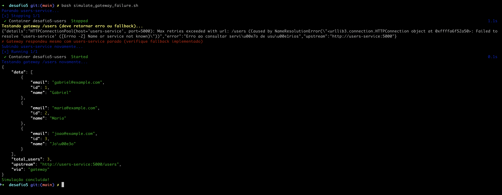

# Challenge 5 — Microservices with API Gateway

## Objective

Create an architecture with **API Gateway** centralizing access to two microservices:

- **Users Service**: provides user data.
- **Orders Service**: provides order data.
- **Gateway**: exposes `/users` and `/orders` endpoints and orchestrates calls to both services.

All services run in Docker containers, orchestrated via `docker-compose`.


## Architecture

- `users-service` (internal port 5000)
  - `GET /users` → list of users in JSON.
- `orders-service` (internal port 5000)
  - `GET /orders` → list of orders in JSON.
- `gateway` (internal port 5000, exposed as 8080 on host)
  - `GET /users` → calls `users-service` via HTTP, returns aggregated response.
  - `GET /orders` → calls `orders-service` via HTTP.
  - Uses environment variables:
    - `USERS_SERVICE_URL`
    - `ORDERS_SERVICE_URL`
  - Single entry point for external consumer: `http://localhost:8080`.

Network:

- Internal network `desafio5-net`, created by Compose.
- Services see each other by hostnames:
  - `users-service`
  - `orders-service`
  - `gateway`


## Quick Execution (Automated)

  # 1) Quick start (one-line)
  cd desafio5 && bash setup.sh && bash test.sh

  # 2) Setup step-by-step
  bash setup.sh

  # 2) Test endpoints via gateway
  bash test.sh

  # 3) Simulate users-service failure
  bash simulate_gateway_failure.sh

  # 4) Stop and clean up
  bash cleanup.sh

## Verify (expected result)

1) Check gateway endpoints:
```bash
curl http://localhost:8080/users
curl http://localhost:8080/orders
```
Expect JSON responses aggregated by the gateway with fields like `via`, `upstream`, and the data arrays.

2) Check that direct service endpoints exist:
```bash
docker compose exec users-service curl -s http://localhost:5000/users
docker compose exec orders-service curl -s http://localhost:5000/orders
```
Expect the original raw JSON returned by each service.

## ▶️ How to execute (Manual)
    To run, you must be in the desafio5 folder

    1) Create
      docker compose up -d --build

    2) Show status
      docker compose ps
    
    3) Test users
      curl http://localhost:8080/users | Select-Object -Expand Content
    
    3.1) Test orders
      curl http://localhost:8080/orders | Select-Object -Expand Content

    3.2) Test users-service
      docker compose exec users-service curl -s http://localhost:5000/users
    
    3.3) Test orders-service
      docker compose exec orders-service curl -s http://localhost:5000/orders

  ## How the Gateway routes

  The `gateway` receives external requests and forwards them internally:

  - `GET /users` → proxy to `users-service` (http://users-service:5000/users)
  - `GET /orders` → proxy to `orders-service` (http://orders-service:5000/orders)

  Backend URLs can be configured via environment variables (`USERS_SERVICE_URL`, `ORDERS_SERVICE_URL`) defined in `docker-compose.yml`.

  ## Troubleshooting

  ### Error: Gateway returns 502/504 error
  Check if `users-service`/`orders-service` are running:
  ```bash
  docker compose ps
  docker compose logs -f gateway
  ```

  ### Error: Port 8080 already in use
  Change the mapping in `docker-compose.yml` or stop the process using port 8080.

  ### CORS / Timeouts
  If the gateway returns timeout, check backend service logs and increase the timeout in the gateway (if applicable).
      docker compose exec orders-service curl -s http://localhost:5000/orders

# Prints





